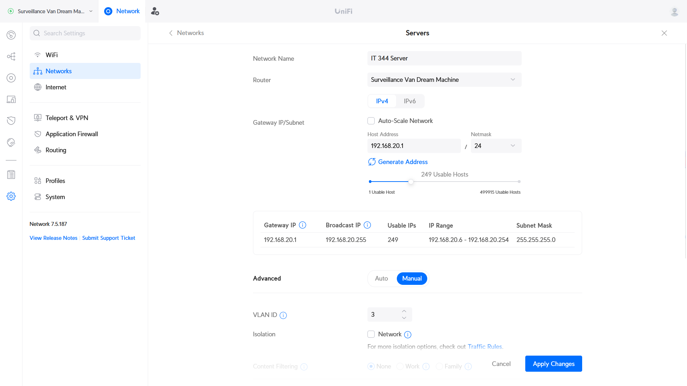
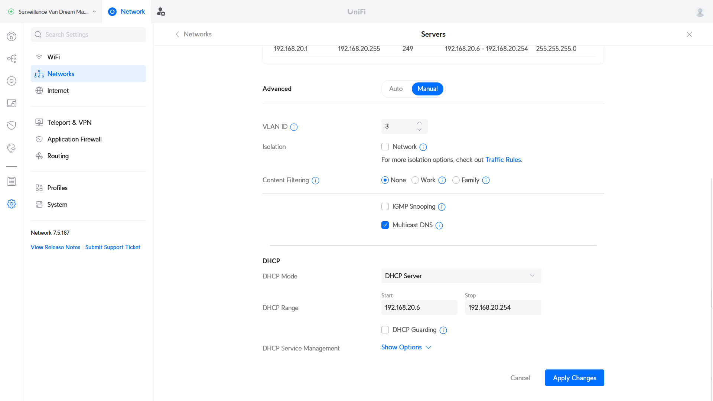
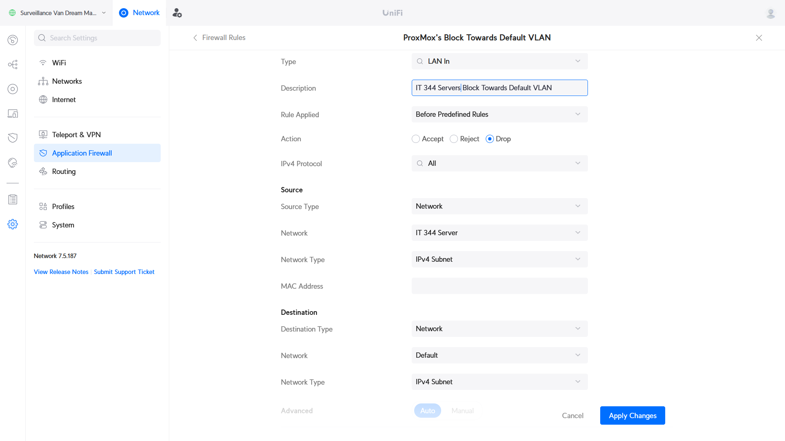
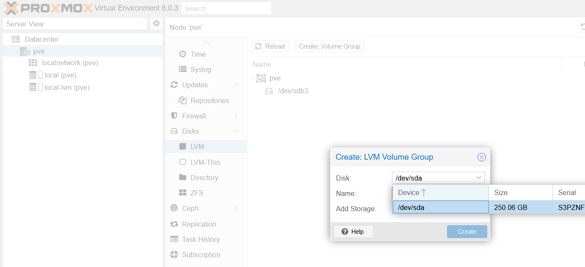
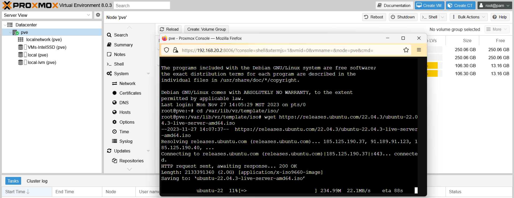

# Resource Monitoring Dashboard for Data Center Infrastructure - Proxmox

Final Project: Sam Swindler, Benj McKinnon, Jensen Wood, Spencer Baird

Goal:
Create a web-based Resource Monitoring Dashboard with user authentication, real-time data visualization, and alerting capabilities to monitor computer resources. This dashboard will offer a comprehensive overview of data center infrastructure VM status and performance metrics from Proxmox. Users will be able to manage resources efficiently, provision and de-provision VMs, and receive notifications for critical events.


Steps:
Our project is broken into 4 main steps. These steps were used to create easy partitions of work, and lead to the ultimate completion of the project.
1. Hardware setup and Proxmox installation
2. Network Configuration
3. Server Backend
4. Website Frontend

This documentation will be a log of what we did, how we did it, the problems we ran into, and will be able to lead anyone through making their own Proxmox.

## Section 1: Hardware Setup and Proxmox Installation

The first part of step 1 was to set up the hardware. Proxmox is a type 1 hypervisor that is ran directly on bare metal, and so we first needed a machine that we could wipe. We debated between running Proxmox in a VM, but decided that it would be more conducive to our project if we made a dedicated proxmox server. This would make it easier to add to a network that would then allow any of us working on the project to SSH into the proxmox server and work on it. 

This is a list of the hardware that we utilized.
- Samsung SSD 850 EVO 250GB
- Intel SSDSC2BW120A4 128 GB
- 12 GB RAM
- Intel Core i5-760 Processor


Two SSDs were used in order to have Proxmox installed on one of the SSDs and to have the VMs installed on the other.

Once our server hardware was setup we installed proxmox onto it. We had previously installed a ProxmoxVE iso onto a flash drive. Then we plugged it in and in the bios selected to boot from the flash drive. This brought us into the ProxmoxVE setup and from there we just followed the setup steps. We knew what network was going to be configured and inputted the following

Proxmox Network Setup

- Hostname: pve.local 
- Ip Address: 192.168.20.2/24
- Gateway: 192.168.20.1
- DNS Server: 192.168.20.1

We then started the install and ran into our first problem. During the install we got this error "Unable to initialize physical volume /dev/sda3". For some reason it was unable to write to our drive. During the setup we chose to install on our Intel SSD. And looking through the bios we could see that the SSD was there and worked correctly. After a quick internet search we discovered that sometimes Proxmox needs to be told to use less than 100% of the drive.

So we reinstalled and during the information we reduced the amount that Proxmox could use to 100GB. And the install went perfectly! And with that, proxmox was installed onto our server and we were ready to start network configuration.

## Section 2: Initial Network Configuration
After assembling our hardware, we connected it up to Sam's home network. Our server PC was attached to an unmanaged network switch, which was attached to Port 4 on of his router. This router is the Ubiquity UniFi Dream Machine (UDM) running UniFi OS v3.1.16. The following configuration was done using that router's tools. 

| Interface Connection | Server Configuration |
|---|---|
|   |  |

### Creating a VLAN
Since we assigned our Proxmox server the static IP address of `192.168.20.2`, we need to add it to a network that is configured to use that address. Additionally, we would like to set up a network firewall to separate the server (which will be running a public-facing website) from the rest of the Sam's home network devices. Both of these can be accomplished by creating a VLAN in the UniFi console and applying firewall rules.

We created a VLAN by going to Settings > Networks > New Virtual Network. There we filled out the fields with the following settings:





After creating the VLAN, we needed to associate it with a specific ethernet interface on the router. Since our server has been connected to port 4 on the UniFi Dream Machine, we assigned that port to the vlan. This is done by going to: UniFi Devices > UniFi Dream Machine > Port Manager > Port 4 and then assigning the "IT 344 Server" network (VLAN 3) as the "Primary Network".


After doing this, we found that we were able to connect to the Proxmox server from devices on Sam's network. 

### Setting up VPN access
Now that we have connection to the Proxmox server within Sam's home network, we needed to create secure access to this server for the other members of the group. We used the UniFi Dream Machine's built-in Wireguard VPN server to do this. This was configured by navigating to: Settings > Teleport & VPN > VPN Server and clicking "Create New". We then filled out the necessary fields (depicted below) and created an individual set of credentials for each of our team members. As we created credentials for each team member, we downloaded the corresponding credentials file to import into Wireguard.

The Wireguard VPN client can be downloaded [here](https://www.wireguard.com/). Be aware that the download page for this VPN may be blocked on BYU networks.


### Router Firewall Configuration
The web dashboard that is being hosted on the Proxmox server will eventually be exposed to the internet. In case our server is compromised, we'd like to prevent it from spreading to other device's on Sam's network. We will achieve this by setting some firewall rules that prevent any connection from the "IT 344 Server" (VLAN3) network being initiated to a destination on Sam's other VLANs.

We did this by going to Settings > Application Firewall > Firewall Rules and clicking "Create Entry". Then we followed the directions from [this article](https://technotim.live/posts/vlan-firewall-unifi/#configuring-firewall-rule), setting the values as shown below:



This step was repeated for the second VLAN on Sam's network (VLAN 2, which is dedicated for IoT devices).

We verified our firewall has been configured correctly by attempting to ping a device on Sam's home network from the Proxmox server. From within Proxmox, if you select the server itself (ours is labeled "pve"), there is a "Console" button in the top-right of the page. This opens a root console that we sent ping commands from.


## Section 3: Initial Proxmox Configuration
Proxmox provides a website for us to configure it from. On boot, the host computer should print out the IP address needed to visit this configuration page. Ours was found at `https://192.168.20.2:8006`

We need to configure our Proxmox instance to take advantage of the second SSD that we installed. This can be done by following these steps:
[source - step 7](https://forum.proxmox.com/threads/proxmox-beginner-tutorial-how-to-set-up-your-first-virtual-machine-on-a-secondary-hard-disk.59559/).
1. Log into Proxmox
2. Navigate to "Datacenter" > "pve" > "Disks" > "LVM" (expand the arrow under "Disks"). 
3. Click "Create Volume Group". We selected our Samsung SSD, gave it an appropriate name, and clicked "Create"



To create our first VM, we need to provide an installation ISO. We could download a copy to our personal machines and re-upload them to Proxmox through the web portal. In order to save time, we opted to instead directly download the ISO to Proxmox. ([source](https://www.servethehome.com/directly-download-an-iso-to-proxmox-ve-for-vm-creation/))
1. In the Proxmox web console, click "pve" > "shell". This should open a second window with a shell controlling a proxmox instance.
2. Change to the directory where Proxmox looks for ISOs by executing `cd /var/lib/vz/template/iso/`
3. `wget` the ISO you want to download, using the download URL. In our case, we did `wget https://releases.ubuntu.com/22.04.3/ubuntu-22.04.3-live-server-amd64.iso`



We repeated this step for several other ISOs to give us some VMs for our web interface to provision and manage.


## Section 4: Setting up our development environment
We'd like to set up two separate virtual machines (VMs). The first will serve as a development environment, where we can write and test the code without affecting anyone using the dashboard. The second will be our production environment, meant to be public-facing to users. In this section we will create our development environment.

### Create our the Virtual Machine
To create our first virtual machine:
[source - step 8](https://forum.proxmox.com/threads/proxmox-beginner-tutorial-how-to-set-up-your-first-virtual-machine-on-a-secondary-hard-disk.59559/).
1. Navigate to "PVE" in the left sidebar.
2. Click "Create VM" in top-right corner of the screen. This shows a VM creation form. Any fields not explicitly mentioned below can be left to their defaults.
3. In "General", we named this machine `Dashboard-DEV`
4. In "OS" we selected the Ubuntu Live server ISO we downloaded to Proxmox in Section 3
5. In "Disks" we made sure our second SSD we set up in Section 3 is selected as our 'Storage'. We didn't anticipate needing more than 32 GB of disk storage for this VM, so we left that as a default, but this could be adjusted as needed.
6. In "CPU" we gave our VM 2 cpu cores. Since we are using an older processor that doesn't have AES hardware support, we had to change the CPU type to `x86-64-v2`. 
7. In "Memory" we gave our VM 4 GB (4096 MB) of RAM to work with.
8. Then we finished the form, allowing Promox to create our VM.

### Install OS: Ubuntu Server
Then we proceed with installing our Ubuntu server:
1. Start the VM by selecting it in the left sidebar and clicking "Start" in the top-right corner.
2. Open a remote console to interact with the VM by clicking "Console" in the top-right corner.
3. Go through the various steps of the Ubuntu installer. Here are the notable setting we set for our installation:
    - When prompted, we updated to the new installer
    - We chose the default "Ubuntu Server" as the base for our installation.
    - We manually configured the network IPv4 connection:
        - Subnet: `192.168.20.0/24`
        - Address: `192.168.20.3`
        - Gateway: `192.168.20.1`
        - Name servers: `192.168.20.1`
        - Search domain: (blank)
    - Our mirror location passed tests, which indicates our network was successfully configured
    - We let the installer perform its default storage configuration of "Use an entire disk"
    - In the profile setup screen, we set:
        - Your name: `dev`
        - Your servers name: `dashbard-dev`
        - Pick a username: `dev`
        - Pick a password: (we provided a password.)
    - We did not install an SSH server
    - We did not install any of the featured snaps
4. We then reboot the machine, hitting 'enter' to exit the installer. Once it has restarted and we are logged in, we acquired and installed updates by doing `sudo apt update` and `sudo apt upgrade`. Then we reboot the machine again with `sudo reboot`
5. (Optional) We also installed and enabled the "qemu-guest-agent" to make it easier for our machine to interact with Proxmox:
    - In the Proxmox Web console: 
        - Select the machine in the left sidebar
        - Click "options"
        - Double click "QEMU Guest Agent"
        - Enable the guest agent
    - On the machine:
        ```bash
            sudo apt install qemu-guest-agent
            shutdown -h now # Necessary to get Proxmox settings to not be orange on the web console.
            # (turn the machine back on again)
            sudo systemctl status qemu-guest-agent # If the machine doesn't report running, try the following commands:
            # sudo systemctl start qemu-guest-agent
            # sudo systemctl enable qemu-guest-agent
        ```
    - See also:
        - [Proxmox VE Wiki](https://pve.proxmox.com/wiki/Qemu-guest-agent)
        - ["Dependency failed error"](https://forum.proxmox.com/threads/dependency-failed-for-qemu-guest-agent.75797/)

### Installing Web tech
Then we install and set up the components we will need for our website. Our design is a traditional LAMP stack (Linux Apache MySQL PHP).
1. Install and configure apache2
```bash
sudo apt install apache2
sudo service apache2 start
sudo service apache2 status # Should indicate "active (running)"
```

- We can further verify the site is working by navigating to the IP address of our machine in a web browser (in our case, `192.168.20.3`). It should show the Apache2 Default Page.
- We'd like to keep all of our source code in one repository, but we also need to let apache read and utilize the code we write. This can be achieved by creating a "symbolic link" between our code repository and the `/var/www/` folder. To do this:
    <!-- IT&C 210 Lab 1a section "Clone your code"-->
    1. Set up a repository on Github
    2. Create an `index.html` file that can serve as a "hello world" of sorts and put it inside of a folder in our repo. We put ours in `/src/dashboard/`
    3. Navigate to the Apache WebRoot folder with `cd /var/www`
    4. Make the current user (our `dev` user) the owner of this folder so they can freely modify it's contents with `sudo chown -R $USER . && sudo chgrp -R $USER .`
    5. Delete the current HTML folder `rm -rf html`
    6. Clone that repository down to the VM with `git clone [URL-of-repo]`, so it is stored in `/var/www/`. NOTE: You cannot clone the repo into your Home folder. This caused issues for us, probably because the Home folder is encrypted and cannot be accessed by the apache service, according to [this source](https://stackoverflow.com/a/39037942)
    7. Create a "symbolic link" in `/var/www` that points to the `/src/dashboard` folder of our repository with `ln -s ~/ProxmoxDashboard/src/dashboard html`. This creates the necessary shortcut that Apache will follow when it tries to access `/var/www/html`. 
- Apache comes with a default configuration file:`/etc/apache2/sites-available/000-default.conf`. We are going to make a copy of this config, modify it for our needs, and then enable it in apache.
    <!-- IT210 Lab 1a, section "Change Default Config"-->
    1. Execute the following commands to navigate to the folder, create a copy of the default config file, and begin editing it.
    ```bash
    cd /etc/apache2/sites-available
    sudo cp 000-default.conf dashboard.conf
    sudo nano dashboard.conf # Opens up a text editor
    ```
    2. We added the following lines inside the `<VirtualHost>` tags:
    ```
    <Directory /var/www/html>
        Options -Indexes
    </Directory
    ```
    <!-- Based on https://linuxconfig.org/turn-off-directory-browsing-on-apache -->
    3. Once you saved your code and closed the editor, disable the default site and enable the new configuration with the following commands:
    ```bash
    sudo a2dissite 000-default.conf
    sudo a2ensite it210_lab.conf    
    # If it says to reload apache, do so:
    sudo systemctl reload apache2
    ```

2. Install the remainder of the LAMP stack (so PHP, MariaDB, and phpMyAdmin)
    - PHP will help us create an interactive website
    - MariaDB will be the database we use for holding login information
    - phpMyAdmin will be the web console for managing our MariaDB.
    ```bash
    sudo apt install -y php-mbstring php-zip php-gd php-json php-curl libapache2-mod-php mariadb-server phpmyadmin
    ```
    <!-- In "Known Issues" it mentions I was missing `libapache2-mod-php` https://github.com/phpmyadmin/phpmyadmin/wiki/DebianUbuntu -->
    - When prompted about which web server to use for `phpMyAdmin`, press space to select apache2 (so the screen reads `[*] apache2`) and tab to select "ok".
    - When prompted about installing a database for `phpMyAdmin`, choose `<Yes>`.
    - When prompted about providing a password for `phpMyAdmin` to register with the database server, leave the field blank and press "enter".
<!-- https://github.com/BYU-ITC-210-Archive/lab-3a-doglman/tree/master/instructions -->
3. Configure the database used by `phpMyAdmin` with a username and password. Enter the database with `sudo mariadb`
    ```sql
    CREATE USER 'developer' IDENTIFIED BY '<password>'; --replace <password> with your own password. Remove the "<" ">" brackets but keep the quotes.
    CREATE DATABASE dashboard;
    GRANT ALL ON dashboard.* TO 'developer';
    FLUSH PRIVELEGES;
    EXIT;
    ```
    - You should be able to log into PHPMyadmin by navigating to the `/phpmyadmin` resource of your VM. So for us, we went to `http://192.168.20.3/phpmyadmin/` in our web browsers.
    - We need to create a table inside our database to hold user information. We will do this by:
        <!-- Step 5 of https://github.com/BYU-ITC-210-Archive/lab-3a-doglman/tree/master/instructions#development-environment-personal-computer-or-lab-computer-->
        1. Log into phpMyAdmin with the credentials we set up earlier (i.e. the username `developer`)
        2. Locate the database in the left-column that we created called `dashboard`
        3. Create a new table called "user" in the database with 4 columns
        4. Add the following fields:

        | Name        | Type      | Length/Values  | Default         | Index   | A_I |  ...  |
        | ----------- | --------- | -------------- | --------------- | ------- | --- | ----- |
        | `id`        | `INT`     |                | ...             | Primary |  ☒  |  ...  |
        | `username`  | `VARCHAR` | `255`          | ...             | Unique  |  ☐  |  ...  |
        | `password`  | `VARCHAR` | `255`          | ...             | ...     |  ☐  |  ...  |
        | `logged_in` | `BOOLEAN` |                | `As defined: 0` | ...     |  ☐  |  ...  |
4. Now we need to provide these credentials to apache, so that it can modify the MariaDB database as users create accounts and log in. We did this by creating a `.env` file in our project's folders with the following contents:
```env
export MYSQL_SERVERNAME=localhost
export MYSQL_USER=developer
export MYSQL_PASSWORD='(the password you set earlier for mariadb)'
export MYSQL_DATABASE=dashboard
```
- We then created an entry in the apache configuration so it knows about these variables. We did this by executing the `apache2_env_setup.sh` script that is included in this repository, in the same folder as where the `.env` file is stored.
- In case you run into any issues after this step, we used the following resources to diagnose:
    - We can view any PHP errors encountered by apache by executing the command `tail -f /var/log/apache2/error.log`
    - We can view if Apache/PHP can read those variables and connect to our database by using the `health_check.php` file in our repository. So for our setup, we could navigate to `http://192.168.20.3/actions/health_check.php` 
5. After restarting Apache wth `sudo service apache2 restart`, we are now able to register users and log into the website with the PHP code from our repository. Here are some of the implemented URLs:
    - http://192.168.20.3/ (main screen. Redirects to login if a user isn't logged in)
    - http://192.168.20.3/views/login.php
    - http://192.168.20.3/views/register.php

Now that we have the LAMP stack installed and a basic website running, we need to create some pages for our website. The next section will set up a dashboard page to monitor the status of our Proxmox datacenter. The section after that will set up a management page for starting, stopping, provisioning, and deprovisioning VMs. <!-- TODO: ADJUST THE WORDING OF THIS PARAGRAPH ONCE ALL THE HEADINGS AND SECTION DIVISIONS ARE FINALIZED -->


## Section 5: Installing and Configuring Grafana 
For the initial installation and setup of Grafana, the tutorial found [here](https://www.linuxsysadmins.com/monitoring-proxmox-with-grafana/) was used as a foundation. Step one of this process was to install and setup InfluxDB however, so following the tutorial found [here](https://www.linuxsysadmins.com/install-influxdb-on-linux-3-easy-steps/), we did the following: 

1. Enabled the Ubunutu repository required to be able to download InfluxDB. 
2. Downloaded and installed the InfluxDB package.
3. Enabled the `influxdb` service to run at startup.
4. Created a firewall exclusion for TCP traffic on port 8086

With InfluxDB now successfully installed, we were ready to create the database within InfluxDB that our Ubuntu VM would be using to house the data it would be monitoring from Proxmox. To do this, we first created an admin user for the InfluxDB installation, after which we created the `mondb` database, as well as the `monuser` user, to whom was given administartive rights over just the `mondb` database.  
  
Finally, in order for Proxmox to be able to talk to the InfluxDB database that we had created, we needed to do some minor configuring on both the InfluxDB installation as well as Proxmox itself.

### InfluxDB
Going to the configuration file found at `/etc/influxdb/influxdb.conf`, the following parameters needed to be enabled:
```
[[udp]]
   enabled = true
   bind-address = ":8089"
   database = "mondb"
   batch-size = 5000
   batch-timeout = "1s"
```
### Proxmox
From the Proxmox dashboard, we navigated to `Datacenter` -> `Metric Server` -> `Add` -> `InfluxDB`. In the newly created Metric Server, we used the following settings:

| Create: InfluxDB |           |               |             |
| ---------------- | -------------- | ------------- | ----------- |
| Name             | `mondb`        | Enabled       | ☒          |
| Server           | `192.168.20.3` | Organization  | `proxmox`   |
| Port             | `8089`         | Bucket        | `proxmox`   |
| Protocol         | `UDP`          | Token         |             |
  
NOTE: The `Server` IP address is the address of the Ubuntu VM which is running the installation of InfluxDB.  
  
With InfluxDB and Proxmox now talking to each other, we needed to install and configure Grafana - the tool that would actually be showing our monitoring dashboard. Similar to the initial setup for InfluxDB, we did the following: 
1. Enabled the Ubunutu repository required to be able to download Grafana. 
2. Downloaded and installed the Grafana package.
3. Enabled the `grafana-server` service to run at startup.

With Grafana now installed on the VM, we once again had to do a small amount of configuring. Going to the file found at `/etc/grafana/grafana.ini`, the following changes were made:
```
[paths]
plugins = /var/lib/grafana/plugins

[server]
protocol = http
http_port = 3000

[security]
admin_user = admin
admin_password = *****
```
Now that Grafana had been successfully configured, we could access the Grafana website by navigating to `192.168.20.3:3000`. Logging in using the credentials configured in the previous step, we were able to sign in and begin setting up our dashboard. Navigating to `Connections` -> `Data Sources` within the dashboard, we added InfluxDB as a new datasource. We then configured it to use the HTTP URL `http://192.168.20.3:8086`, and added our `mondb` database using the credentials from the user `monuser`. Upon hitting `Save & test` at the bottom of the page, Grafana informed us that the configuration was successful, and that we had seven measurement types available.  
  
With the data now being passed between Proxmox and Grafan without issue, all we needed to do was create a Dashboard as a way to view all of the information. To do this, we navigated to `Dashboards` -> `New` -> `New dashboard` -> `Import a dashboard`. We imported the dashboard found [here](https://grafana.com/grafana/dashboards/10048) by entering the code 10048, after which we were simply asked to enter the name (Proxmox Dashboard), and we had a fully functional Grafana dashboard. 

## Step 6: Embedding Grafana Dashboard into Website
Now that we had a fully functional Grafana dashboard, we needed to embed it into the Apache webserver. While this was a relatively straightforward process, it is important to note that by default (similar to many other websites), Grafana does not allow its pages to be embedded into any other page, whether it be with a `frame` tag, `iframe` tag, `embed` tag, etc. In order to change this, we followed Grafana's documentation listed [here](https://grafana.com/blog/2023/10/10/how-to-embed-grafana-dashboards-into-web-applications/#snapshot) that tells us to set `allow_embedding` to true within Grafana's configuration file. This meant once again returning to `/etc/grafana/grafana.ini` and making the following change in the `[Security]` section:
```
allow_embedding = true
```
With this completed, we simply needed to modify our `index.php` file found in `/var/www/html` to use an `iframe` tag, embedding the dashboard into our own website. While Grafana does support sharing public versions of the Dashboard that still function in realtime, they are still a beta feature and currently don't support any of the data variables we had on our dashboard. Instead, we simply embedded the entire dashboard page as if you were logged into the Grafana website, although enabled the built-in `kiosk` mode and disabled editing to prevent any accidental changes caused by users.  
  
With some clever usage of CSS and a `<div>` tag, we had a fully responsive Grafana dashboard accessible from our own Apache webserver. 

## Section 7: Creating a Management Page
We would like to create a page from which we can manage some of our VMs from. To do this, we chose to install a PHP library to talk to the Proxmox API for us. We chose to use [this library](https://github.com/zzantares/ProxmoxVE). This library requires the use of the [Composer dependency manager](https://getcomposer.org/). This manager installs itself and other PHP libraries on a per-project basis. 

Here is what we did to get the API installed and running:
1. Navigate to the `dashboard` portion of our repository: `cd /var/www/ProxmoxDashboard/src/dashboard/`.
2. Following [these instructions](https://getcomposer.org/download/) for a local installation, we executed the following commands: (this left a `composer.phar` file in our repository).
```bash
php -r "copy('https://getcomposer.org/installer', 'composer-setup.php');"
php -r "if (hash_file('sha384', 'composer-setup.php') === 'e21205b207c3ff031906575712edab6f13eb0b361f2085f1f1237b7126d785e826a450292b6cfd1d64d92e6563bbde02') { echo 'Installer verified'; } else { echo 'Installer corrupt'; unlink('composer-setup.php'); } echo PHP_EOL;"
php composer-setup.php
php -r "unlink('composer-setup.php');"
```
3. We then followed some of the instructions from [this guide](https://getcomposer.org/doc/01-basic-usage.md):
    - We created a `composer.json` file with the following contents:
    ```json
    {
        "require": {
            "zzantares/proxmoxve": "~4.0"
        }
    }
    ```
    - We ran the command `php composer.phar update`. This installs the `zzantares/proxmoxve` libary by creating a `vendor` folder and a `composer.lock` file for storing and managing the installed libraries.
4. Then we modified the contents of the `manage.php` file (in our repository) to utilize this API.
    - Helpful API reference links include:
        - https://pve.proxmox.com/pve-docs/api-viewer/index.html (lists the path to resources as an interactive site.)
5. As needed, we constructed scripts, storing them in `/actions/`, to create the different functions that we needed for our app.

For additional info, see the source code in this repository.

## Section 8: (Optional) Creating VMs to manage
As a last step, we created some VMs for our dashboard to monitor and control. We set up a Kali VM.

## Section 9: Enabling Grafana Alerts
We wanted to be able to receive customized alerts for certain events going on with our VMs or with the Proxmox installation. Lucily, Grafana has a built-in alert system utilizing the metrics it collects for its dashboard, meaning we wouldn't need to worry about collecting data a second time just for the purpose of alerts. To create a functional alert system within Grafana, there were two main tasks we needed to complete:
1. Enable a "contact point" (a way for Grafana to send out emails)
2. Configure a rule by which Grafana can determine when to send alerts

### Contact Point
This was, for the most part, very straightforward. Returning to the Grafana configuration file we modified in sections 5 and 6 (located in `/etc/grafana/grafana.ini`), we first needed to adjust some settings in the `smtp` section. The changes were as follows:
```
enabled = true
host = smtp.gmail.com:587
user = *****@gmail.com
password = "*****"
skip_verify = true
from_address = *****@gmail.com
from_name = Grafana
```
Using this configuration, a personal Gmail account can be used as the email address to send out alerts. However, it is important to note that Google *does not* allow integration by default. Users who want to use a Gmail account need to first enable two-factor authentication within their account security settings (found [here](https://myaccount.google.com/signinoptions/two-step-verification/enroll-welcome)), after which they will need to locate "App passwords" at the bottom of the page and create a password specifically for Grafana. Using this application-specific password should allow Grafana to access and use the Gmail account without issue.  
  
With the Grafana configuration file successfully updated, we then needed to actually setup the "contact point" within the Grafana web interface itself. Navigtating back to `192.168.20.3:3000`, the section we needed to go to was located in `Alerting` -> `Contact points` -> `Add contact point`. This was where we were able to designate who the recipients would be for the alert emails, as well as having the option to adjust a few more miscellaneous settings. 

### Alert Rule
With the alert delivery system now fully functional, we simply needed to configure Grafana to know when to send alerts. To create new alert rules, we navigated to `Alerting` -> `Alert rules` -> `New alert rules`. This brought up a very robust alert creation tool. The first step was to write a query for the available data sources in the InfluxDB database used to house the information displayed by the Grafana dashboard. This allowed us to isolate what metric we want to monitor to determine when to send alerts. We then created a rule that would act based on the retrieved data. With the data successfully queried and the alert rule configured, we were able to test and confirm that email alerts were sent correctly. In our case, this meant that whenever a VM is powered on or powered off, and email alert is sent to the designed list of email addresses. 

# Appendix
Part of our design comes from IT&C 210 Labs 1 - 3. We acknowledge Brandt Redd as the provider of those labs.

**IP Address Reference Table**

| IP          | Description                      |
|-------------|----------------------------------|
|192.168.20.2 | Proxmox VE - Login on Port 8006  |
|192.168.20.3 | Ubuntu - Development Server      |
|192.168.20.3 | :80/phpmyadmin/ - phpMyAdmin     |
|192.168.20.3 | :3000 - Graphana                 |
|192.168.3.5  | VPN - Sam                        |


<!--
Future work:
- I would have liked to adjust the partitioning on the drive with Proxmox installed. The way it is currently installed, about half of the drive is for Proxmox (and uploaded ISOs) and the other half is for VMs, which is wasted space (since we're storing VMs on the 2nd SSD instead).
I found this forum post about trying to fix such an issue: https://forum.proxmox.com/threads/need-to-delete-local-lvm-and-reuse-the-size.34087/

 -->