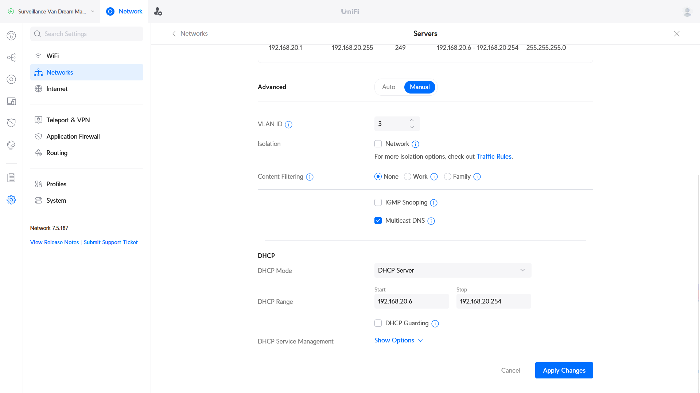
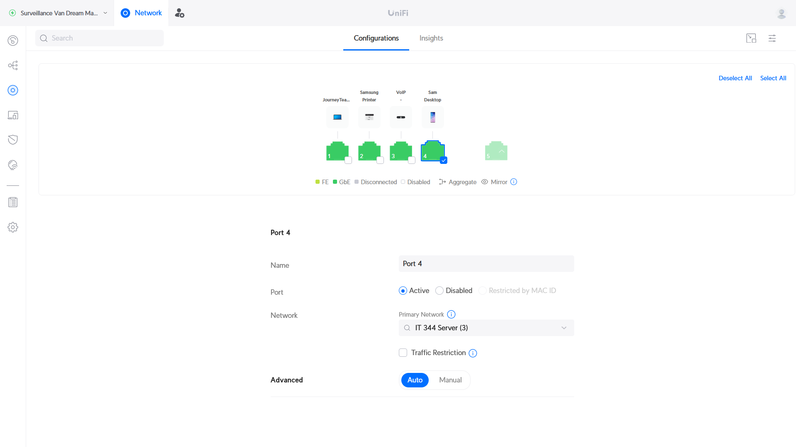

# Resource Monitoring Dashboard for Data Center Infrastructure - Proxmox

Final Project: Sam Swindler, Benj McKinnon, Jensen Wood, Spencer Baird

Goal:
Create a web-based Resource Monitoring Dashboard with user authentication, real-time data visualization, and alerting capabilities to monitor computer resources. This dashboard will offer a comprehensive overview of data center infrastructure VM status and performance metrics from Proxmox. Users will be able to manage resources efficiently, provision and de-provision VMs, and receive notifications for critical events.

Steps:
Our project is broken into 4 main steps. These steps were used to create easy partitions of work, and lead to the ultimate completion of the project.
1. Hardware setup and Proxmox installation
2. Network Configuration
3. Server Backend
4. Website Frontend

This documentation will be a log of what we did, how we did it, the problems we ran into, and will be able to lead anyone through making their own Proxmox.

## Section 1: Hardware Setup and Proxmox Installation

The first part of step 1 was to set up the hardware. Proxmox is a type 1 hypervisor that is ran directly on bare metal, and so we first needed a machine that we could wipe. We debated between running Proxmox in a VM, but decided that it would be more conducive to our project if we made a dedicated proxmox server. This would make it easier to add to a network that would then allow any of us working on the project to SSH into the proxmox server and work on it. 

This is a list of the hardware that we utilized.
- Samsung SSD 850 EVO 250GB
- Intel SSDSC2BW120A4 128 GB
- 12 GB RAM
- Intel Core i5-760 Processor

Two SSDs were used in order to have Proxmox installed on one of the SSDs and to have the VMs installed on the other.

Once our server hardware was setup we installed proxmox onto it. We had previously installed a ProxmoxVE iso onto a flash drive. Then we plugged it in and in the bios selected to boot from the flash drive. This brought us into the ProxmoxVE setup and from there we just followed the setup steps. We knew what network was going to be configured and inputted the following

Proxmox Network Setup

- Hostname: pve.local 
- Ip Address: 192.168.20.2/24
- Gateway: 192.168.20.1
- DNS Server: 192.168.20.1

We then started the install and ran into our first problem. During the install we got this error "Unable to initialize physical volume /dev/sda3". For some reason it was unable to write to our drive. During the setup we chose to install on our Intel SSD. And looking through the bios we could see that the SSD was there and worked correctly. After a quick internet search we discovered that sometimes Proxmox needs to be told to use less than 100% of the drive.

So we reinstalled and during the information we reduced the amount that Proxmox could use to 100GB. And the install went perfectly! And with that, proxmox was installed onto our server and we were ready to start network configuration.

## Section 2: Network Configuration
After assembling our hardware, we connected it up to Sam's home network. Our server PC was attached to an unmanaged network switch, which was attached to Port 4 on of his router. This router is the Ubiquity UniFi Dream Machine (UDM) running UniFi OS v3.1.16. The following configuration was done using that router's tools. 

| Interface Connection | Server Configuration |
|---|---|
|   |  |

### Creating a VLAN
Since we assigned our Proxmox server the static IP address of `192.168.20.2`, we need to add it to a network that is configured to use that address. Additionally, we would like to set up a network firewall to separate the server (which will be running a public-facing website) from the rest of the Sam's home network devices. Both of these can be accomplished by creating a VLAN in the UniFi console and applying firewall rules.

We created a VLAN by going to Settings > Networks > New Virtual Network. There we filled out the fields with the following settings:

After creating the VLAN, we needed to associate it with a specific ethernet interface on the router. Since our server has been connected to port 4 on the UniFi Dream Machine, we assigned that port to the vlan. This is done by going to: UniFi Devices > UniFi Dream Machine > Port Manager > Port 4 and then assigning the "IT 344 Server" network (VLAN 3) as the "Primary Network".

After doing this, we found that we were able to connect to the Proxmox server from devices on Sam's network. 

### VPN configuration
Now that we have connection to the Proxmox server within Sam's home network, we needed to create secure access to this server for the other members of the group. We used the UniFi Dream Machine's built-in Wireguard VPN server to do this. This was configured by navigating to: Settings > Teleport & VPN > VPN Server and clicking "Create New". We then filled out the necessary fields (depicted below) and created an individual set of credentials for each of our team members.

### Firewall Configuration
The web dashboard that is being hosted on the Proxmox server will eventually be exposed to the internet. In case our server is compromised, we'd like to prevent it from spreading to other device's on Sam's network. We will achieve this by setting some firewall rules that prevent any connection from the "IT 344 Server" (VLAN3) network being initiated to a destination on Sam's other VLANs.

We did this by going to Settings > Application Firewall > Firewall Rules and clicking "Create Entry". Then we followed the directions from [this article](https://technotim.live/posts/vlan-firewall-unifi/#configuring-firewall-rule), setting the values as shown below:

This step was repeated for the second VLAN on Sam's network (VLAN 2, which is dedicated for IoT devices).

We verified our firewall has been configured correctly by attempting to ping a device on Sam's home network from the Proxmox server. From within Proxmox, if you select the server itself (ours is labeled "pve"), there is a "Console" button in the top-right of the page. This opens a root console that we sent ping commands from.