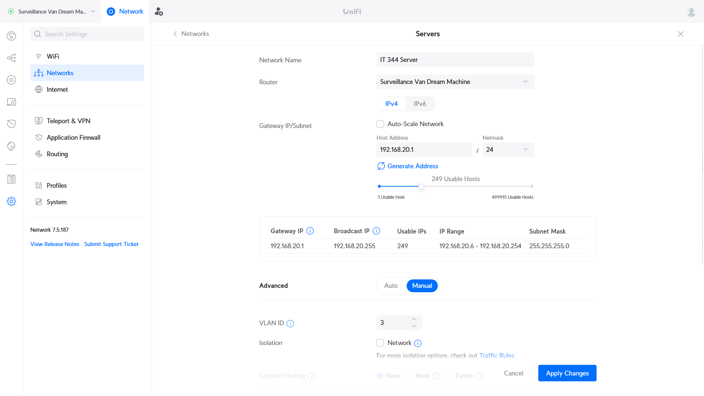

# Resource Monitoring Dashboard for Data Center Infrastructure - Proxmox

Final Project: Sam Swindler, Benj McKinnon, Jensen Wood, Spencer Baird

Goal:
Create a web-based Resource Monitoring Dashboard with user authentication, real-time data visualization, and alerting capabilities to monitor computer resources. This dashboard will offer a comprehensive overview of data center infrastructure VM status and performance metrics from Proxmox. Users will be able to manage resources efficiently, provision and de-provision VMs, and receive notifications for critical events.


Steps:
Our project is broken into 4 main steps. These steps were used to create easy partitions of work, and lead to the ultimate completion of the project.
1. Hardware setup and Proxmox installation
2. Network Configuration
3. Server Backend
4. Website Frontend

This documentation will be a log of what we did, how we did it, the problems we ran into, and will be able to lead anyone through making their own Proxmox.

## Section 1: Hardware Setup and Proxmox Installation

The first part of step 1 was to set up the hardware. Proxmox is a type 1 hypervisor that is ran directly on bare metal, and so we first needed a machine that we could wipe. We debated between running Proxmox in a VM, but decided that it would be more conducive to our project if we made a dedicated proxmox server. This would make it easier to add to a network that would then allow any of us working on the project to SSH into the proxmox server and work on it. 

This is a list of the hardware that we utilized.
- Samsung SSD 850 EVO 250GB
- Intel SSDSC2BW120A4 128 GB
- 12 GB RAM
- Intel Core i5-760 Processor


Two SSDs were used in order to have Proxmox installed on one of the SSDs and to have the VMs installed on the other.

Once our server hardware was setup we installed proxmox onto it. We had previously installed a ProxmoxVE iso onto a flash drive. Then we plugged it in and in the bios selected to boot from the flash drive. This brought us into the ProxmoxVE setup and from there we just followed the setup steps. We knew what network was going to be configured and inputted the following

Proxmox Network Setup

- Hostname: pve.local 
- Ip Address: 192.168.20.2/24
- Gateway: 192.168.20.1
- DNS Server: 192.168.20.1

We then started the install and ran into our first problem. During the install we got this error "Unable to initialize physical volume /dev/sda3". For some reason it was unable to write to our drive. During the setup we chose to install on our Intel SSD. And looking through the bios we could see that the SSD was there and worked correctly. After a quick internet search we discovered that sometimes Proxmox needs to be told to use less than 100% of the drive.

So we reinstalled and during the information we reduced the amount that Proxmox could use to 100GB. And the install went perfectly! And with that, proxmox was installed onto our server and we were ready to start network configuration.

## Section 2: Initial Network Configuration
After assembling our hardware, we connected it up to Sam's home network. Our server PC was attached to an unmanaged network switch, which was attached to Port 4 on of his router. This router is the Ubiquity UniFi Dream Machine (UDM) running UniFi OS v3.1.16. The following configuration was done using that router's tools. 

| Interface Connection | Server Configuration |
|---|---|
|   |  |

### Creating a VLAN
Since we assigned our Proxmox server the static IP address of `192.168.20.2`, we need to add it to a network that is configured to use that address. Additionally, we would like to set up a network firewall to separate the server (which will be running a public-facing website) from the rest of the Sam's home network devices. Both of these can be accomplished by creating a VLAN in the UniFi console and applying firewall rules.

We created a VLAN by going to Settings > Networks > New Virtual Network. There we filled out the fields with the following settings:





After creating the VLAN, we needed to associate it with a specific ethernet interface on the router. Since our server has been connected to port 4 on the UniFi Dream Machine, we assigned that port to the vlan. This is done by going to: UniFi Devices > UniFi Dream Machine > Port Manager > Port 4 and then assigning the "IT 344 Server" network (VLAN 3) as the "Primary Network".


After doing this, we found that we were able to connect to the Proxmox server from devices on Sam's network. 

### Setting up VPN access
Now that we have connection to the Proxmox server within Sam's home network, we needed to create secure access to this server for the other members of the group. We used the UniFi Dream Machine's built-in Wireguard VPN server to do this. This was configured by navigating to: Settings > Teleport & VPN > VPN Server and clicking "Create New". We then filled out the necessary fields (depicted below) and created an individual set of credentials for each of our team members. As we created credentials for each team member, we downloaded the corresponding credentials file to import into Wireguard.

The Wireguard VPN client can be downloaded [here](https://www.wireguard.com/). Be aware that the download page for this VPN may be blocked on BYU networks.


### Router Firewall Configuration
The web dashboard that is being hosted on the Proxmox server will eventually be exposed to the internet. In case our server is compromised, we'd like to prevent it from spreading to other device's on Sam's network. We will achieve this by setting some firewall rules that prevent any connection from the "IT 344 Server" (VLAN3) network being initiated to a destination on Sam's other VLANs.

We did this by going to Settings > Application Firewall > Firewall Rules and clicking "Create Entry". Then we followed the directions from [this article](https://technotim.live/posts/vlan-firewall-unifi/#configuring-firewall-rule), setting the values as shown below:


This step was repeated for the second VLAN on Sam's network (VLAN 2, which is dedicated for IoT devices).

We verified our firewall has been configured correctly by attempting to ping a device on Sam's home network from the Proxmox server. From within Proxmox, if you select the server itself (ours is labeled "pve"), there is a "Console" button in the top-right of the page. This opens a root console that we sent ping commands from.


## Section 3: Initial Proxmox Configuration
Proxmox provides a website for us to configure it from. On boot, the host computer should print out the IP address needed to visit this configuration page. Ours was found at `https://192.168.20.2:8006`

We need to configure our Proxmox instance to take advantage of the second SSD that we installed. This can be done by following these steps:
[source - step 7](https://forum.proxmox.com/threads/proxmox-beginner-tutorial-how-to-set-up-your-first-virtual-machine-on-a-secondary-hard-disk.59559/).
1. Log into Proxmox
2. Navigate to "Datacenter" > "pve" > "Disks" > "LVM" (expand the arrow under "Disks"). 
3. Click "Create Volume Group". We selected our Samsung SSD, gave it an appropriate name, and clicked "Create"


To create our first VM, we need to provide an installation ISO. We could download a copy to our personal machines and re-upload them to Proxmox through the web portal. In order to save time, we opted to instead directly download the ISO to Proxmox. ([source](https://www.servethehome.com/directly-download-an-iso-to-proxmox-ve-for-vm-creation/))
1. In the Proxmox web console, click "pve" > "shell". This should open a second window with a shell controlling a proxmox instance.
2. Change to the directory where Proxmox looks for ISOs by executing `cd /var/lib/vz/template/iso/`
3. `wget` the ISO you want to download, using the download URL. In our case, we did `wget https://releases.ubuntu.com/22.04.3/ubuntu-22.04.3-live-server-amd64.iso`


We repeated this step for several other ISOs to give us some VMs for our web interface to provision and manage.


## Section 4: Setting up our development environment
We'd like to set up two separate virtual machines (VMs). The first will serve as a development environment, where we can write and test the code without affecting anyone using the dashboard. The second will be our production environment, meant to be public-facing to users. In this section we will create our development environment.

To create our first virtual machine:
[source - step 8](https://forum.proxmox.com/threads/proxmox-beginner-tutorial-how-to-set-up-your-first-virtual-machine-on-a-secondary-hard-disk.59559/).
1. Navigate to "PVE" in the left sidebar.
2. Click "Create VM" in top-right corner of the screen. This shows a VM creation form. Any fields not explicitly mentioned below can be left to their defaults.
3. In "General", we named this machine `Dashboard-DEV`
4. In "OS" we selected the Ubuntu Live server ISO we downloaded to Proxmox in Section 3
5. In "Disks" we made sure our second SSD we set up in Section 3 is selected as our 'Storage'. We didn't anticipate needing more than 32 GB of disk storage for this VM, so we left that as a default, but this could be adjusted as needed.
6. In "CPU" we gave our VM 2 cpu cores. Since we are using an older processor that doesn't have AES hardware support, we had to change the CPU type to `x86-64-v2`. 
7. In "Memory" we gave our VM 4 GB (4096 MB) of RAM to work with.
8. Then we finished the form, allowing Promox to create our VM.

Then we proceed with installing our Ubuntu server:
1. Start the VM by selecting it in the left sidebar and clicking "Start" in the top-right corner.
2. Open a remote console to interact with the VM by clicking "Console" in the top-right corner.
3. Go through the various steps of the Ubuntu installer. Here are the notable setting we set for our installation:
    - When prompted, we updated to the new installer
    - We chose the default "Ubuntu Server" as the base for our installation.
    - We manually configured the network IPv4 connection:
        - Subnet: `192.168.20.0/24`
        - Address: `192.168.20.3`
        - Gateway: `192.168.20.1`
        - Name servers: `192.168.20.1`
        - Search domain: (blank)
    - Our mirror location passed tests, which indicates our network was successfully configured
    - We let the installer perform its default storage configuration of "Use an entire disk"
    - In the profile setup screen, we set:
        - Your name: `dev`
        - Your servers name: `dashbard-dev`
        - Pick a username: `dev`
        - Pick a password: (we provided a password.)
    - We did not install an SSH server
    - We did not install any of the featured snaps
4. We then reboot the machine, hitting 'enter' to exit the installer. Once it has restarted and we are logged in, we acquired and installed updates by doing `sudo apt update` and `sudo apt upgrade`. Then we reboot the machine again with `sudo reboot`
5. (Optional) We also installed and enabled the "qemu-guest-agent" to make it easier for our machine to interact with Proxmox:
    - In the Proxmox Web console: 
        - Select the machine in the left sidebar
        - Click "options"
        - Double click "QEMU Guest Agent"
        - Enable the guest agent
    - On the machine:
        ```bash
            sudo apt install qemu-guest-agent
            shutdown -h now # Necessary to get Proxmox settings to not be orange on the web console.
            # (turn the machine back on again)
            sudo systemctl status qemu-guest-agent # If the machine doesn't report running, try the following commands:
            # sudo systemctl start qemu-guest-agent
            # sudo systemctl enable qemu-guest-agent
        ```
    - See also:
        - [Proxmox VE Wiki](https://pve.proxmox.com/wiki/Qemu-guest-agent)
        - ["Dependency failed error"](https://forum.proxmox.com/threads/dependency-failed-for-qemu-guest-agent.75797/)

Then we install and set up the components we will need for our website. Our design is a traditional LAMP stack (Linux Apache MySQL PHP).
1. Install and configure apache2
```bash
sudo apt install apache2
sudo service apache2 start
sudo service apache2 status # Should indicate "active (running)"
```

- We can further verify the site is working by navigating to the IP address of our machine in a web browser (in our case, `192.168.20.3`). It should show the Apache2 Default Page.
- Apache comes with a default configuration file:`/etc/apache2/sites-available/000-default.conf`. We are going to make a copy of this config, modify it for our needs, and then enable it in apache.
<!-- IT210 Lab 1a, section "Change Default Config"-->

```bash
cd /etc/apache2/sites-available
sudo cp 000-default.conf it210_lab.conf

```
TODO - ABOVE CODE BLOCK IS INCOMPLETE

2. Install the remainder of the LAMP stack (so PHP, MariaDB, and phpMyAdmin)
    - PHP will help us create an interactive website
    - MariaDB will be the database we use for holding login information
    - phpMyAdmin will be the web console for managing our MariaDB.
    ```bash
    sudo apt install -y php-mbstring php-zip php-gd php-json php-curl mariadb-server phpmyadmin
    ```
    - When prompted about which web server to use for `phpMyAdmin`, press space to select apache2 (so the screen reads `[*] apache2`) and tab to select "ok".
    - When prompted about installing a database for `phpMyAdmin`, choose `<Yes>`.
    - When prompted about providing a password for `phpMyAdmin` to register with the database server, leave the field blank and press "enter".
<!-- https://github.com/BYU-ITC-210-Archive/lab-3a-doglman/tree/master/instructions -->
3. Configure `phpMyAdmin` with a username and password.
```bash
sudo mariadb
CREATE USER 'developer' IDENTIFIED BY '<password>'; # replace <password> with your own password. Remove the "<" ">" brackets but keep the quotes.
```
TODO - ABOVE CODE BLOCK IS INCOMPLETE

# Appendix
Part of our design comes from IT&C 210 Labs 1 - 3. We acknowledge Brandt Redd as the provider of those labs.

**IP Address Reference Table**

| IP          | Description                      |
|-------------|----------------------------------|
|192.168.20.2 | Proxmox VE - Login on Port 8006  |
|192.168.20.3 | Ubuntu - Development Server      |
|192.168.3.5  | VPN - Sam                        |